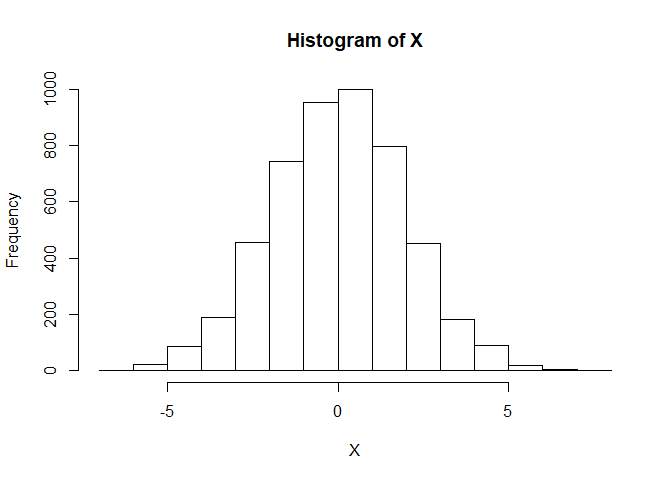
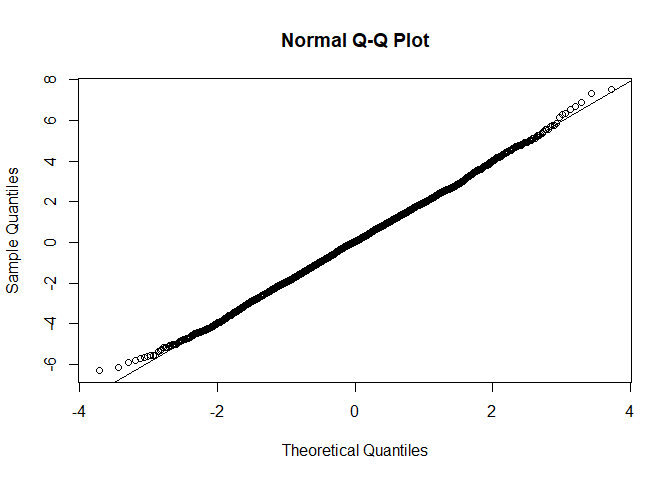
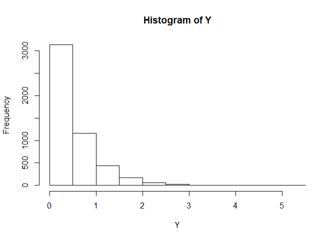
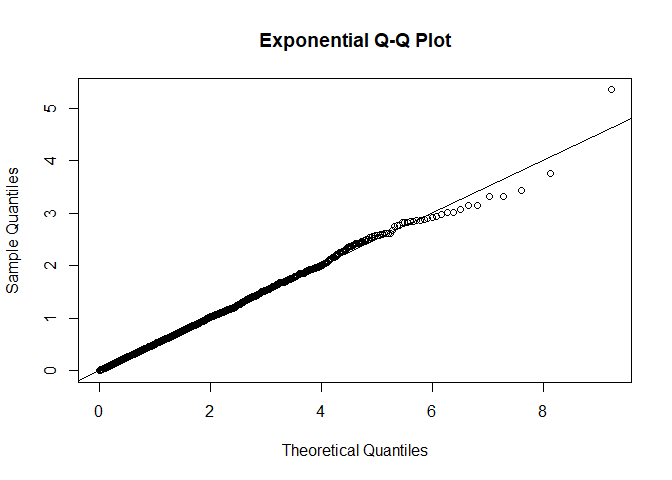
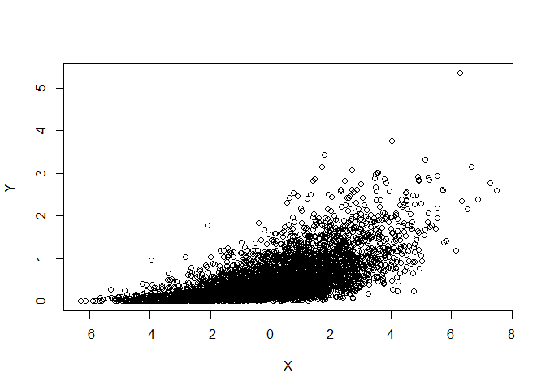
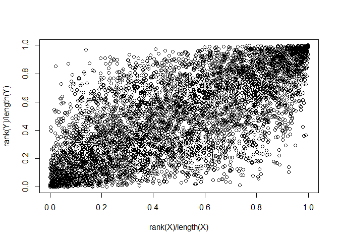
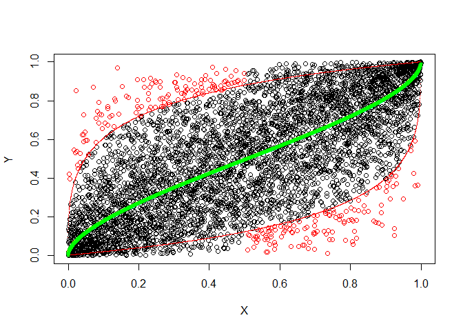

Anomalies Detection Example
================
Ran Pang

## 1\. Introduction

Anomaly detection is the identification of rare items, events or
observations which raise suspicions by differeing significantly from the
majority of the data. Anomaly or rare events detection is an important
problem for many applications besides analysis of weather anomalies, for
example, financial portfolio management, fraud detection, cyber
security, etc.

In this particular demonstration, the anomaly detection problem is a
byvariate anomalies when the underlying variables are not Gaussian and
may have nonlinear relationship. The sample data have two variables: X &
Y and the goal is to use copula and quantile distribution to detect
anomalies.

This demonstration is based on the course assignment of MScA Linear and
Nonlinear Models at the University of Chicago.

## 2\. Data Preparation

### 2.1 Libraries

``` r
library(RNetCDF)
library(copula)
library(MASS)
```

### 2.2 Data Import

``` r
# Import data
data <- read.table(paste(dataPath, 'data.csv', sep = '/'), header = TRUE)
X <- data$x_sample
Y <- data$y_sample
dim(data)
```

    ## [1] 5000    2

### 2.3 Visualization

**Summary:**

**1) The distribution of both X (normal) and Y (exponential) have long
tails;**

**2) Higher Y value is associated with higher X value. There may be a
non-Gaussian relationship that cannot be captured by correlation and
linear regression;**

**3) There are dependencies on both tails between X and Y;**

**4) Common Pearson correlation detects more correlation than Spearman,
but less correlation than Kendall.**

#### 2.3.1 Visualize each variable

``` r
# Histogram & Normal Q-Q plot for X
hist(X)
```

<!-- -->

``` r
qqplot(x = qnorm(ppoints(5000)), y = X, main = "Normal Q-Q Plot",
       xlab = "Theoretical Quantiles", ylab = "Sample Quantiles")
qqline(X, distribution = qnorm)
```

<!-- -->

``` r
# Histogram & Exponential Q-Q plot for X
hist(Y)
```

<!-- -->

``` r
qqplot(x = qexp(ppoints(5000)), y = Y, main = "Exponential Q-Q Plot",
       xlab = "Theoretical Quantiles", ylab = "Sample Quantiles")
qqline(Y, distribution = qexp)
```

<!-- -->

The Q-Q plots shows that the distribution of both X (normal) and Y
(exponential) have long tails.

#### 2.3.2 Visualize the relationship between two variables

``` r
# Scatter plot
plot(X, Y)
```

<!-- -->

From the above scatter plot, We observe the comonotonic relationship:
higher Y value is associated with higher X value. The shape of the cloud
suggests that there may be a non-Gaussian relationship that cannot be
captured by correlation and linear regression.

``` r
# Empirical copula plot
plot(rank(X)/length(X), 
     rank(Y)/length(Y))
```

<!-- -->

From the empirical copula plot we can discover that there are
dependencies on both tails.

``` r
# Calculate Pearson, Spearman and Kendall correlation coefficients
pearsonCor <- cor(X, Y, method = c("pearson"))
spearmanCor <- cor(X, Y, method = c("kendall"))
kendallCor <- cor(X, Y, method = c("spearman"))

c(Pearson = pearsonCor, Spearman = spearmanCor, Kendall = kendallCor)
```

    ##   Pearson  Spearman   Kendall 
    ## 0.6431759 0.4987618 0.6874486

Rank correlation coefficients, such as Spearman’s rank correlation
coefficient and Kendall’s rank correlation coefficient measure the
extent to which, as one variable increases, the other variable tends to
increase, without requiring that increase to be represented by a linear
relationship. These are more robust and have been recommended if the
data do not necessarily come from a bivariate normal distribution.

Common Pearson correlation detects more correlation than Spearman, but
less correlation than Kendall.

## 3\. Anomamlies detection using copula

### 3.1 Why copula?

**The advantages of using copula for anomalies detection:**

**1) It allows bivariate anomalies, like high-x-low-Y;**

**2) It allows nonlinear dependency of the variables;**

**3) It does not depend on Gaussian assumption and allows fat or short
tails of distributions.**

### 3.2 Copula fit and selection

``` r
# Fit Gaussian copula
copula.type <- c("Gaussian")
copulaFitData <- cbind(X, Y)
Copula.Fit.Object <- normalCopula(param = 0, dim = 2)
Copula.fit <- fitCopula(Copula.Fit.Object, 
                        pobs(copulaFitData, ties.method = "average"), 
                        method = "ml",
                        optim.method = "BFGS", 
                        optim.control = list(maxit = 1000))
Copula.fit.Gaussian <- Copula.fit
Copula.fit.Gaussian
```

    ## Call: fitCopula(copula, data = data, method = "ml", optim.method = "BFGS", 
    ##     optim.control = ..3)
    ## Fit based on "maximum likelihood" and 5000 2-dimensional observations.
    ## Copula: normalCopula 
    ##  rho.1 
    ## 0.7052 
    ## The maximized loglikelihood is 1715 
    ## Optimization converged

``` r
# Fit Frank copula
copula.type <- c("Frank")
copulaFitData <- cbind(X, Y)
Copula.Fit.Object <- frankCopula(param = 5, dim = 2)
Copula.fit <- fitCopula(Copula.Fit.Object, 
                        pobs(copulaFitData, ties.method = "average"), 
                        method = "ml",
                        optim.method = "BFGS", 
                        optim.control = list(maxit = 1000))
Copula.fit.Frank <- Copula.fit
Copula.fit.Frank
```

    ## Call: fitCopula(copula, data = data, method = "ml", optim.method = "BFGS", 
    ##     optim.control = ..3)
    ## Fit based on "maximum likelihood" and 5000 2-dimensional observations.
    ## Copula: frankCopula 
    ## alpha 
    ## 5.677 
    ## The maximized loglikelihood is 1571 
    ## Optimization converged

Gaussian copula fit has a higher maximized loglikelihood value, so it
will be used to estimate quantiles.

### 3.3 Quantile estimation

Select 5%, 95% and 50% levels and estimate quantiles of conditional
distribution \(P(V \le v|U=u)\), where \([U,V]\) are the fitted Gaussian
copula to the variables of X and Y.

``` r
theta <- Copula.fit.Gaussian@estimate
nTime <- (length(X) + 1)
xRanks <- rank(X)/nTime

alpha <- .05
lowBound <- sapply(xRanks,
                   function(z) 
                     pnorm(qnorm(alpha)*sqrt(1 - theta^2) + theta*qnorm(z)))
alpha <- .95
highBound <- sapply(xRanks,
                   function(z) 
                     pnorm(qnorm(alpha)*sqrt(1 - theta^2) + theta*qnorm(z)))
alpha <- .5
midBound <- sapply(xRanks,
                   function(z) 
                     pnorm(qnorm(alpha)*sqrt(1 - theta^2) + theta*qnorm(z)))
```

### 3.4 Anomalies labeling

Empirical copula plot is created with upper, lower and median quantiles
predicted by the fitted Gaussian copula.

Since the anomaly is defined as deviation from comonotonic dependency
between X and Y, anomalies are detected and labeled when data points are
higher than the upper quantile with low value of X (less than 0.5), or
lower than the lower quantile with high value of X (greater than 0.5).

``` r
anomLowIdx <- (rank(Y)/nTime < lowBound) & (rank(X)/nTime > .5)
anomHighIdx <- (rank(Y)/nTime > highBound) & (rank(X)/nTime < .5)

plot(rank(X)/nTime, rank(Y)/nTime, xlab = "X", ylab = "Y")

points(rank(X)/nTime, lowBound, col = "red", pch = ".")
points(rank(X)/nTime, highBound, col = "red", pch = ".")

points(rank(X)/nTime, midBound, col = "green", pch="*", lwd = 2)

points(rank(X)[anomLowIdx]/nTime, rank(Y)[anomLowIdx]/nTime, col = "red")
points(rank(X)[anomHighIdx]/nTime, rank(Y)[anomHighIdx]/nTime, col = "red")
```

<!-- -->
